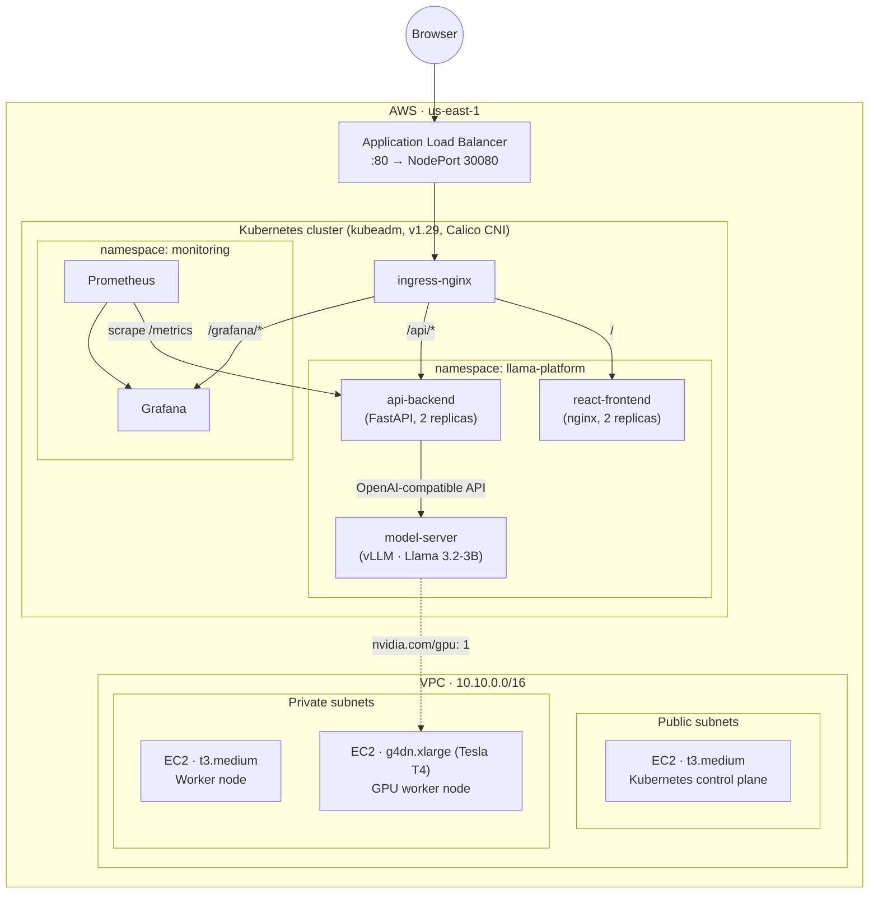

# 🦙 LLaMA K8s Platform

A self-hosted LLM inference platform that runs **LLaMA 3.2-3B** on a GPU-backed **Kubernetes** cluster in AWS — provisioned with Terraform, served through **vLLM**, fronted by a **FastAPI** backend and a **React** chat UI, and observed with **Prometheus + Grafana**.

Everything from the VPC to the chat window lives in this repo: infrastructure as code, cluster bootstrapping scripts, application source, container builds, and Kubernetes manifests.

> **Live example:** `https://chat.jimmyneville.com`

---

## Contents

- [Architecture](#architecture)
- [Repository layout](#repository-layout)
- [Tech stack](#tech-stack)
- [Prerequisites](#prerequisites)
- [Deploying the platform](#deploying-the-platform)
  - [1. Bootstrap Terraform state](#1-bootstrap-terraform-state)
  - [2. Provision AWS infrastructure](#2-provision-aws-infrastructure)
  - [3. Bootstrap the Kubernetes cluster](#3-bootstrap-the-kubernetes-cluster)
  - [4. Enable GPU scheduling](#4-enable-gpu-scheduling)
  - [5. Build and publish application images](#5-build-and-publish-application-images)
  - [6. Deploy the applications](#6-deploy-the-applications)
  - [7. Expose the platform](#7-expose-the-platform)
  - [8. Install monitoring](#8-install-monitoring)
- [Local application development](#local-application-development)
- [Configuration reference](#configuration-reference)
- [Tearing it down](#tearing-it-down)
- [Roadmap](#roadmap)

---

## Architecture



**Request flow:** the browser hits the ALB, which forwards to the ingress-nginx `NodePort` on any cluster node. Ingress routes `/` to the React SPA and `/api/*` to FastAPI, which strips its prefix and proxies chat requests to vLLM's OpenAI-compatible `/v1/chat/completions` endpoint over the cluster's internal `ClusterIP` service. The model server is pinned to the single GPU-equipped node via `nodeSelector` and requests `nvidia.com/gpu: 1`.

## Repository layout

```
.
├── applications/
│   ├── model-server/       # vLLM + Llama 3.2-3B inference server
│   ├── api-backend/        # FastAPI proxy, metrics, request shaping
│   └── react-frontend/     # Chat UI (Create React App, served by nginx)
│
└── infrastructure/
    ├── terraform/           # VPC, EC2 nodes, ALB, IAM, security groups
    │   └── bootstrap-backend/  # One-time S3 + DynamoDB remote state setup
    └── kubernetes/
        ├── cluster-setup/   # kubeadm, CNI, NVIDIA driver/plugin scripts
        └── manifests/       # Deployments, services, ingress, monitoring
```

## Tech stack

| Layer | Technology |
|---|---|
| Infrastructure | Terraform, AWS (VPC, EC2, ALB, IAM, S3/DynamoDB remote state) |
| Orchestration | Kubernetes v1.29 (kubeadm), Calico CNI, ingress-nginx |
| GPU | NVIDIA driver 535, NVIDIA Container Toolkit, NVIDIA k8s device plugin, Tesla T4 (g4dn.xlarge) |
| Model serving | [vLLM](https://github.com/vllm-project/vllm) OpenAI-compatible server, `meta-llama/Llama-3.2-3B-Instruct` |
| Backend | FastAPI, httpx, `prometheus-client` |
| Frontend | React 18, axios, nginx (production build) |
| Observability | kube-prometheus-stack (Prometheus + Grafana), Prometheus Operator `ServiceMonitor` |

## Prerequisites

- AWS account with credentials configured locally (`aws configure` / SSO)
- [Terraform](https://developer.hashicorp.com/terraform) ~> 1.x
- `kubectl`
- Docker (with `buildx` for `linux/amd64` builds, e.g. on Apple Silicon)
- An ECR repository (or equivalent registry) to hold the built images
- A HuggingFace account with access granted to `meta-llama/Llama-3.2-3B-Instruct`, plus an [access token](https://huggingface.co/settings/tokens)
- AWS Systems Manager Session Manager plugin (nodes are reached via SSM, not bare SSH)

## Deploying the platform

The platform is built up in four phases: infrastructure, cluster bootstrap, GPU enablement, and application deployment.

### 1. Bootstrap Terraform state

The main Terraform stack uses an S3 backend with DynamoDB locking. That backend has to exist before the main stack can use it:

```bash
cd infrastructure/terraform/bootstrap-backend
terraform init
terraform apply
```

### 2. Provision AWS infrastructure

```bash
cd infrastructure/terraform
terraform init
terraform apply
```

This creates:
- A VPC (`10.10.0.0/16`) spanning 3 AZs with public/private subnets and a NAT gateway
- One `t3.medium` control-plane node (public subnet) and one `t3.medium` worker node (private subnet)
- One `g4dn.xlarge` GPU worker node (private subnet, Tesla T4)
- An SSH key pair (private key written locally to `k8s-private-key.pem`)
- An internet-facing ALB target-grouped to each node's NodePort `30080`
- Security groups locked down to your current public IP for admin access
- IAM roles enabling SSM Session Manager access to every node

Nodes are reached with SSM rather than SSH:

```bash
terraform output ssm_commands
aws ssm start-session --target <instance-id>
```

### 3. Bootstrap the Kubernetes cluster

Run against all three nodes (via SSM), in order — see [`infrastructure/kubernetes/cluster-setup/notes.md`](infrastructure/kubernetes/cluster-setup/notes.md) for the full walkthrough:

```bash
# On all 3 nodes
./install-k8s.sh

# On the control-plane node — initializes kubeadm, installs Calico CNI,
# and prints a worker join command
./init-master.sh

# On both worker nodes, with sudo — paste the join command from above
kubeadm join ...

# On the GPU worker node only
./install-gpu-drivers.sh
# then reboot and verify with `nvidia-smi`
```

Copy `/etc/kubernetes/admin.conf` from the control-plane node to your local `~/.kube/config` to manage the cluster from your machine.

### 4. Enable GPU scheduling

From your local machine, with `kubectl` pointed at the new cluster:

```bash
./infrastructure/kubernetes/cluster-setup/deploy-gpu-plugin.sh
```

This installs the NVIDIA device plugin DaemonSet and verifies `nvidia.com/gpu` shows up as allocatable on the GPU node.

### 5. Build and publish application images

Each application ships with a `build-image.sh` that builds for `linux/amd64` (matching the EC2 nodes) and prints the tag/push commands for ECR:

```bash
cd applications/model-server && ./build-image.sh
cd applications/api-backend && ./build-image.sh
cd applications/react-frontend && ./build-image.sh
```

Then tag and push each to your ECR repository, e.g.:

```bash
docker tag llama-vllm-server:latest <account-id>.dkr.ecr.<region>.amazonaws.com/llama-vllm-server
docker push <account-id>.dkr.ecr.<region>.amazonaws.com/llama-vllm-server
```

### 6. Deploy the applications

Create the image-pull and model secrets, then apply the manifests:

```bash
kubectl create namespace llama-platform

kubectl create secret docker-registry ecr-secret \
  --docker-server=<account-id>.dkr.ecr.<region>.amazonaws.com \
  --docker-username=AWS \
  --docker-password=$(aws ecr get-login-password --region <region>) \
  --namespace=llama-platform

kubectl create secret generic huggingface-token \
  --from-literal=token=<your-hf-token> \
  --namespace=llama-platform

kubectl apply -f infrastructure/kubernetes/manifests/model-server/
kubectl apply -f infrastructure/kubernetes/manifests/api-backend/
kubectl apply -f infrastructure/kubernetes/manifests/react-frontend/
```

> The `ecr-secret` is a plain Kubernetes secret and expires with the ECR token — re-create it periodically, or automate rotation (see [Roadmap](#roadmap)).

The model server takes several minutes to become ready on first boot (image pull + model download + vLLM engine startup), so its liveness/readiness probes allow a 5-minute grace period.

### 7. Expose the platform

Deploy the ingress controller and the routing rules, updating the `host` field to your own domain:

```bash
kubectl apply -f infrastructure/kubernetes/manifests/ingress-controller/
kubectl apply -f infrastructure/kubernetes/manifests/ingress/
```

Point a DNS `A`/`CNAME` record at the ALB's DNS name (`terraform output` in the `infrastructure/terraform` directory) to serve the app on your own domain.

### 8. Install monitoring

```bash
helm repo add prometheus-community https://prometheus-community.github.io/helm-charts
helm repo update

helm install prometheus prometheus-community/kube-prometheus-stack \
  --namespace monitoring \
  --create-namespace \
  --set grafana.enabled=true \
  --set grafana.service.type=ClusterIP

kubectl apply -f infrastructure/kubernetes/manifests/monitoring/
```

This installs Prometheus + Grafana, a `ServiceMonitor` that scrapes `/metrics` on the FastAPI backend every 30s, and an ingress path exposing Grafana at `/grafana`. Fetch the generated admin password with:

```bash
kubectl get secret prometheus-grafana -n monitoring \
  -o jsonpath="{.data.admin-password}" | base64 --decode
```

## Local application development

**Backend** (`applications/api-backend`):

```bash
pip install -r requirements.txt
python main.py   # serves on :8080, proxies to VLLM_SERVICE_URL
```

**Frontend** (`applications/react-frontend`):

```bash
npm install
npm start         # serves on :3000, proxies /api to :8080 in dev
```

By default the backend proxies to the in-cluster vLLM service DNS name; for local end-to-end testing, run vLLM separately (or point `VLLM_SERVICE_URL` in `main.py` at any OpenAI-compatible endpoint) and adjust as needed.

## Configuration reference

| Setting | Where | Notes |
|---|---|---|
| Model | `applications/model-server/download_model.py` | `meta-llama/Llama-3.2-3B-Instruct`, requires HF access grant |
| vLLM tuning | `applications/model-server/start_server.py` | GPU memory utilization, context length, max concurrent sequences |
| Backend → model URL | `applications/api-backend/main.py` | `VLLM_SERVICE_URL`, defaults to the in-cluster service DNS |
| Domain | `infrastructure/kubernetes/manifests/ingress/main-ingress.yaml` | Ingress `host` |
| Cluster sizing | `infrastructure/terraform/ec2.tf` | Instance types, subnet placement, volume sizing |
| VPC/CIDR layout | `infrastructure/terraform/locals.tf` | `10.10.0.0/16`, 3 AZs |

## Tearing it down

```bash
cd infrastructure/terraform
terraform destroy

# only if you're done with the project entirely
cd bootstrap-backend
terraform destroy
```

The GPU worker (`g4dn.xlarge`) is the primary cost driver — destroy or stop it when the platform isn't in active use.

## Roadmap

Tracked in [`TODO.md`](TODO.md):

- Automate ECR credential rotation for `ecr-secret` (currently manual/expires)
- Move model weights to a real persistent volume instead of `emptyDir`
- Resolve an outstanding in-cluster DNS issue
